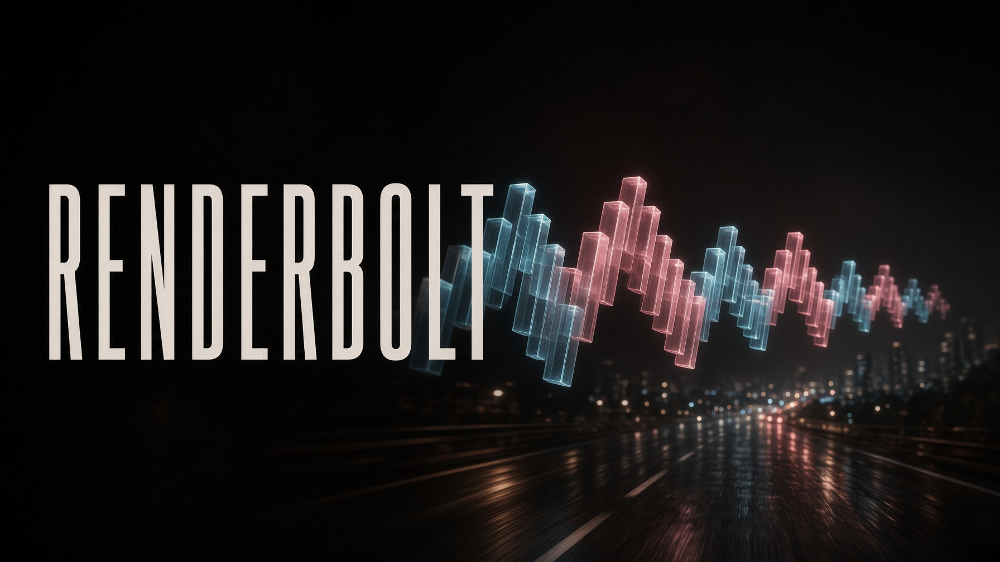
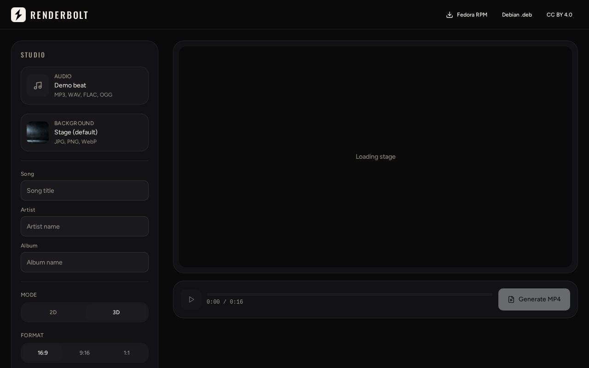

# Renderbolt

Cinematic audio visualizer. Drop in a song and a still, pick a look, and export an MP4 on your machine.

Designed by **JMHBM**. [CC BY 4.0](LICENSE).

**Public release: [1.0.6](https://github.com/JMHBM/Renderbolt/releases/tag/1.0.6)** · Debian / Ubuntu `.deb`  
`main` is 1.0.7 in progress. Windows installer is built from `main` (Inno Setup). Fedora / RPM last. macOS later.

[](https://github.com/JMHBM/Renderbolt/actions/workflows/check.yml)
[](https://github.com/JMHBM/Renderbolt/actions/workflows/windows.yml)
[](LICENSE)





## Install (1.0.6)

```bash
sudo apt install ./renderbolt_1.0.6_all.deb
```

Get the file from the [v1.0.6 release](https://github.com/JMHBM/Renderbolt/releases/tag/1.0.6). Needs Python 3.10+, Tk, Pillow, NumPy, and FFmpeg. On AMD GPUs, install `mesa-va-drivers`.

Open **Renderbolt** from the app menu, or run `renderbolt`.

### Windows (1.0.7 / `main`)

Inno Setup installer, 64-bit. Download **Renderbolt-1.0.7-setup.exe** from the [windows workflow artifacts](https://github.com/JMHBM/Renderbolt/actions/workflows/windows.yml) (not on the 1.0.6 GitHub Release yet).

On a Windows 11 machine you can also build it:

```powershell
python scripts\build-windows.py
```

That bundles FFmpeg. AMD cards use **AMF**, NVIDIA **NVENC**, Intel **QSV**, with CPU fallback.

## From source (`main` / 1.0.7)

```bash
sudo apt install python3-tk python3-pil python3-pil.imagetk python3-numpy ffmpeg
pip install -r desktop/requirements.txt
python3 desktop/renderbolt
```

Headless (no window):

```bash
python3 desktop/renderbolt render \
  --audio song.mp3 --cover art.jpg --out out.mp4 \
  --look looks/night-drive.json
```

Starter looks live in [`looks/`](looks/README.md). Keys **1–6** load them in the studio.

## What it does

- Background still from disk, with beat bounce and edge fade
- Optional song / artist / album titles
- 2D or 3D: waveform, EQ bars, circular, liquid
- Color presets, custom palette, base → tip gradient
- Place, rotate (0–360°), stretch, and mirror
- Live preview, then VA-API H.264 on AMD when present
- 16:9 · 9:16 · 1:1 · 720p / 1080p / 4K · 24 / 30 / 60 fps

### Shortcuts (1.0.7 / `main`)

| Key | Action |
|---|---|
| Space | Play / pause |
| G | Generate MP4 |
| R | Shuffle look |
| 1–6 | Starter looks |
| S | Save current frame (PNG) |
| F1 | About |
| ← → | Seek 2 seconds |
| Home | Restart |
| Ctrl+O | Open audio |
| Ctrl+I | Open background |

## Wiki

- [Welcome](https://github.com/JMHBM/Renderbolt/wiki/Welcome-to-Renderbolt)
- [Getting started](https://github.com/JMHBM/Renderbolt/wiki/Getting-Started)
- [Studio](https://github.com/JMHBM/Renderbolt/wiki/Studio)
- [Visual engine](https://github.com/JMHBM/Renderbolt/wiki/Visual-Engine)
- [Roadmap](https://github.com/JMHBM/Renderbolt/wiki/Roadmap)

## License

[CC BY 4.0](LICENSE) — credit **JMHBM**.
